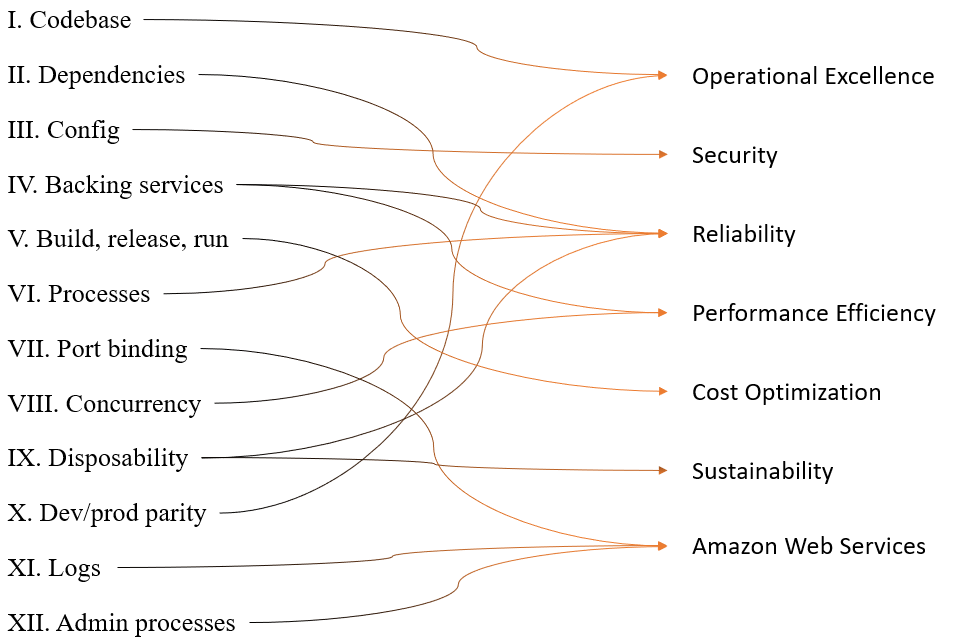

# AWS 기반 12-Factor App 및 Well-Architected Framework 설계 가이드

## 1. 개요: 클라우드 네이티브 패러다임의 변화

* **12-Factor App:** 2011년 Heroku 개발자들이 발표한 이식성과 복원력이 뛰어난 SaaS 애플리케이션 구축을 위한 12가지 원칙입니다.
* **AWS Well-Architected Framework (WAF):** AWS에서 2012년부터 발전시켜 온 모범 사례 모음으로, 안전하고 고성능이며 비용 효율적인 시스템 구축을 지원합니다.

---

## 2. AWS WAF 6대 핵심 요소와 12-Factor 매핑

### 2.1 운영 우수성 (Operational Excellence)

시스템을 효율적으로 운영하고 지속적으로 개선하는 능력입니다.

* **관련 12-Factor:** * **코드베이스 (1):** 하나의 코드베이스로 모든 환경에 배포하여 운영 부담을 절감합니다.
* **개발/생산 환경 동등성 (10):** 개발과 운영 환경을 최대한 유사하게 유지하여 배포 오류를 방지합니다.

* **주요 서비스:** AWS CodePipeline, CloudFormation, Systems Manager.

### 2.2 보안 (Security)

데이터와 시스템을 보호하고 보안 태세를 강화합니다.

* **관련 12-Factor:** * **구성 (3):** 환경 변수를 코드가 아닌 실행 환경에 저장하여 보안을 유지하고 이동성을 확보합니다.
* **주요 서비스:** IAM, Secrets Manager, KMS, WAF.
* **공동 책임 모델:** AWS(클라우드 자체 보안)와 고객(클라우드 내부 보안)이 역할을 분담합니다.

### 2.3 안정성 (Reliability)

장애를 극복하고 수요에 따라 자원을 조절하는 능력입니다.

* **관련 12-Factor:** * **백엔드 서비스 (4):** 외부 서비스를 리소스로 취급하여 코드 변경 없이 교체 가능하게 합니다.
* **종속성 (2):** 종속성을 명시적으로 선언하고 격리하여 시스템 복구 속도를 높입니다.
* **프로세스 (6):** 상태가 없는(Stateless) 프로세스로 실행하여 탄력적 확장을 지원합니다.
* **폐기 가능성 (9):** 빠른 시작과 종료를 통해 복원력을 높입니다.

* **주요 서비스:** Auto Scaling, ELB, Route 53, Backup.

### 2.4 성능 효율성 (Performance Efficiency)

컴퓨팅 리소스를 효율적으로 사용하고 기술 발전에 맞춰 진화하는 능력입니다.

* **관련 12-Factor:** * **동시성 (8):** 프로세스 모델을 통해 수평 확장(Scale-out)을 구현합니다.
* **백엔드 서비스 (4):** 적절한 리소스를 선택하여 성능을 극대화합니다.

* **주요 서비스:** EC2, S3, Lambda, CloudFront.

### 2.5 비용 최적화 (Cost Optimization)

비즈니스 가치를 최저 가격으로 제공하는 지침입니다.

* **관련 12-Factor:** * **빌드, 릴리스, 실행 (5):** 철저한 단계 분리를 통해 배포 오류로 인한 불필요한 비용 발생을 차단합니다.
* **주요 서비스:** Cost Explorer, Compute Optimizer, Spot Instances.

### 2.6 지속 가능성 (Sustainability)

환경적 영향을 최소화하는 현대적인 설계 지침입니다.

* **관련 12-Factor:** * **폐기 가능성 (9):** 리소스를 즉시 시작/종료하여 에너지 소비를 최적화합니다.
* **주요 서비스:** Customer Carbon Footprint Tool, Graviton 프로세서.

---

## 3. 기타 핵심 클라우드 원칙

* **포트 바인딩 (7):** 애플리케이션을 특정 포트에 바인딩하여 독립적으로 운영합니다. (ECS, EKS 등 활용)
* **로그 (11):** 로그를 이벤트 스트림으로 처리하여 중앙 집중식으로 관리합니다. (CloudWatch 활용)
* **관리 프로세스 (12):** 관리 작업을 격리된 환경에서 수행합니다. (제어 평면과 데이터 평면 분리)

---

## 4. 최종 총정리 (Summary)

| 분류 | 주요 12-Factor 원칙 | 핵심 AWS 전략 |
| --- | --- | --- |
| **개발 단계** | 코드베이스(1), 종속성(2) | IaC(CloudFormation), Git 기반 관리 |
| **설정 및 환경** | 구성(3), 환경 동등성(10) | Secrets Manager, Parameter Store |
| **실행 및 배포** | 빌드/릴리스/실행(5), 포트 바인딩(7) | CI/CD 파이프라인, 컨테이너화 |
| **확장 및 복구** | 프로세스(6), 동시성(8), 폐기 가능성(9) | Stateless 아키텍처, Auto Scaling |
| **운영 및 관리** | 로그(11), 관리 프로세스(12) | 중앙 집중형 로깅, Managed 서비스 활용 |

### 설계 시 주의사항

* **사후 검토가 아닌 사전 설계:** Well-Architected 프레임워크는 개발 완료 후의 체크리스트가 아니라, 아키텍처 설계 단계에서부터 반영되어야 하는 가이드라인입니다.
* **격리된 관리 프로세스:** 일회성 관리 작업이 메인 애플리케이션 성능에 영향을 주지 않도록 제어 평면(Control Plane)을 분리하여 설계해야 합니다.