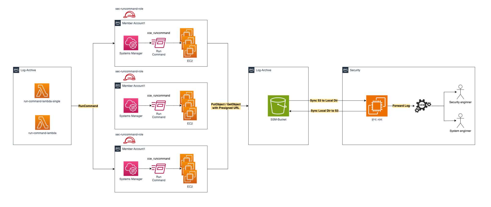
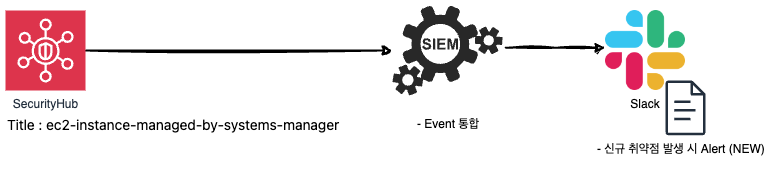
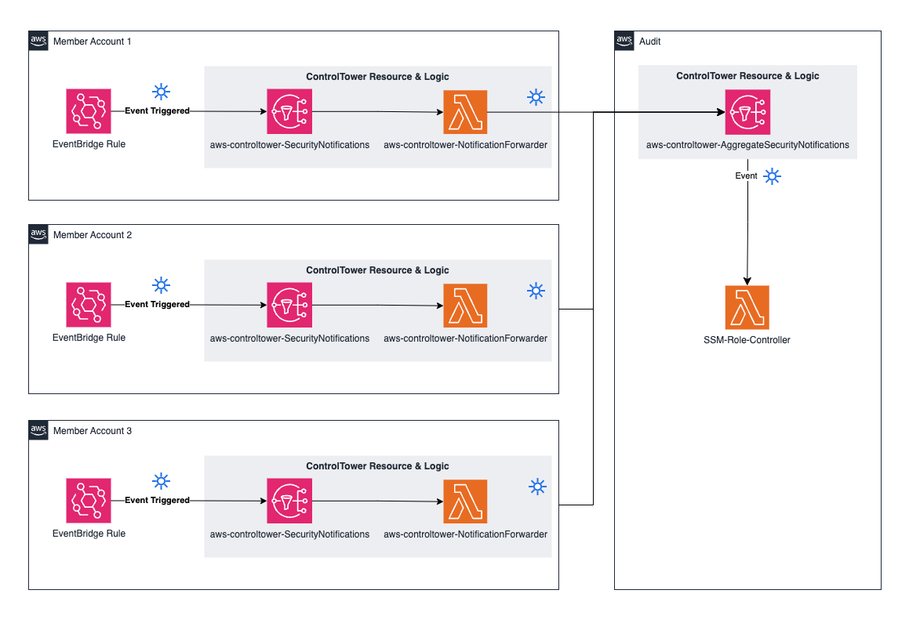
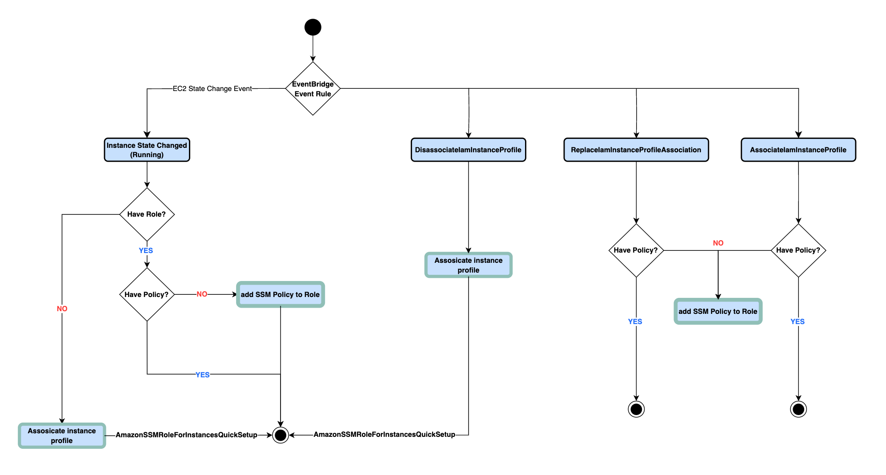

출처 : https://aws.amazon.com/ko/blogs/tech/building-ec2-diagnostics-automation-using-systems-manager-part1/

- 빗썸은 EC2 인스턴스 기반의 워크로드를 운영하고 있는 환경에서 EC2 인스턴스 취약점 점검은 중요한 과제이다.
- 유연하게 확장되는 EC2 인스턴스를 안전하게 사용하기 위해 취약점 점검을 자동으로 진행해야 할 필요성 존재
    - **AWS Systems Manager Run Command** 를 이용해 자동화된 보안 점검 시스템을 구축
    - **AWS SSM**
        1. **Session Manager**(보안)
            1. SSH 키 없이 22번 포트 열지 않아도 웹 브라우저나 CLI 에서 서버에 접속할 수 있음
            2. Bastion 호스트를 만들 필요가 없고 모든 명령어 실행 기록이 CloudTrail에 남아서 보안 감사 가능
            3. 거버넌스 연결 : 모든 서버 접속은 Session Manager 을 통해서만 가능하다 라는 규정을 강제할 수있음
        2. **Run Command**(대규모 원격 제어)
            1. 서버 100대에 동시에 똑같은 스크립트를 실행하고 싶을 때 사용
            2. 서버에 직접 로그인할 필요없음
        3. **Patch Manager**(자동 패치)
            1. OS와 애플리케이션 보안 패치를 자동으로 스케줄링해서 설치
            2. Patch Baseline: 보안 등급이 Critical 인 패치는 출시 3일 뒤에 자동으로 깔아라 같은 규칙을 정할 수 있음
            3. Maintenance Windows : 서비스에 영향이 없는 새벽 시간대에만 패치가 돌아가도록 설정
        4. **Parameter Store**(설정값 저장소)
            1. DB 비밀번호, API 키 , 환경 변수 같은 민감한 정보를 안전하게 저장하고 관리
            2. Secrets Manager와의 차이
                1. 단순 설정값이나 무료로 쓰고 싶을대는 Parameter Store를 비밀번호 자동 교체(Rotation이 필요할 때는 Secrets Manager를 사용한다.)
            3. 계층구조 : /prod/db/password 같은 경로 형태로 관리할 수 있어 관리가 편하다.
        5. **Automation**(워크플로 자동화)
            1. 여러 단계의 복잡한 작업을 하나의 런북으로 만들어 자동화
            2. 비정상적인 EC2 인스턴스가 발견되면 자동으로 격리하고 스냅샷을 찍은 뒤 관리자에게 알림을 보내라 같은 흐름을 만들 수 있음

## 개념 아키텍처와 흐름도

본 아키텍처는 아래와 같은 기준을 만족하도록 구성

- 맴버 계정 대상으로 점검 실행 및 결과 수집을 하는 계정은 특정 계정에서 모두 수행돼야 함
- 전체 인스턴스 대상 또는 단일 인스턴스 대상으로 취약점 점검이 가능해야 함
- 인프라에 대한 구성 변경 없이 취약점 점검을 수행할 수 있어야 한다.
- 보안 컴플라이언스의 요구사항이 변경될 경우, 스크립트를 유연하게 수정할 수 있어야 한다.



AWS Control Tower 서비스를 사용해 다수의 맴버계정을 관리하고 있는 환경에서 각 계정 내 존재하는 EC2 인스턴스에 취약점 점검을 실행하기 위한 아키텍처 다이어그램

- **AWS Control Tower**
    
    OU 에 적용하는 거버넌스 도구로 AWS Organizations 는 SCP를 작성해서 적용해야 하지만 Control Tower은 가드레일을 클릭 몇번으로 적용 가능
    
    상태는 control Tower 에 등록 과정을 거쳐야 관리되고 규정준수 리포트를 제공
    

중앙 계정의 Lambda 함수에서 각 계정마다 존재하는 IAM 역할로 스위칭하며 AWS Systems Manager의 Run Command  기능을 수행해 인스턴스의 보안 취약점 점검을 진행

- 보안 취약점 점검 작업은 중앙 계정의 S3 버킷에 있는 점검 스크립트를 사용하도록 하였고 점검 결과 또한 하나의 S3에 통합하여 수집되도록 구성.
- 통합된 분석 결과도 중앙계정에서 분석할 수 있는 체계 만들었다.

## 1. AWS 의 보안 모범 사례에 따른 EC2 ↔ Systems Manager 설정 과정

- 빗썸은 EC2 인스턴스가 프라이빗 서브넷에 배치되어 있고, 보안 그룹을 통해 아웃바운드 규칙을 세부적으로 관리하여 운영하고 있었음
- 이 환경에서 AWS SSM 서비스를 위해 각 서브넷에 VPC 엔드포인트를 생성
- EC2는 PrivateLink 를 통해 SSM 서비스에 접근할 수 있게 되고 SSM 에이전트를 통해 정상적으로 안전하게 트래픽을 주고받을 수 있는 환경 구성됨
    - **PrivateLink**
        
        VPC 안에서 AWS 서비스(S3나 EC2등) 외부 SaaS 서비스를 호출하려면 IGW를 타고 밖으로 나갔다 와야하지만 PrivateLink 를 사용하면 내 VPC 안에 해당 서비스로 연결되는 가상 랜선(엔드포인트)가 연결됨
        
        - 인터넷 노출 차단됨
        - Interface VPC Endpoint :  내 VPC 특정 서브넷에 프라이빗 IP 가 할당된 ENI 가 생기는데 이게 서비스로 가는 입구 역할을 한다.
        - 단방향 연결 : 트래픽은 항상 내 VPC에서 서비스쪽으로만 흘러 훨씬 안전하다.
        
        VPC Peering과의 차이점
        
        |  | VPC Peering | AWS PrivateLink |
        | --- | --- | --- |
        | 연결 범위 | 두 VPC 전체 연결 | 특정 서비스만 골라서 연결 |
        | IP 중복 | CIDR 겹치면 연결 불가 | IP 대역이 겹쳐도 상관없음 |
        | 복잡도 | 라우팅 테이블 설정을 다 해줘야 함 | 엔드포인트만 만들면 끝 |
    - EC2가 생성된 각 서브넷 별로 Systems Manager 용 VPC 엔드포인트를 사용하여 EC2 인스턴스의 보안 개선 문서에 따라 VPC 엔드포인트를 생성
    - EC2에서 VPC 엔드포인트와의 통신을 위해 보안 그룹 아웃바운드 규칙(443포트/ 인터페이스 엔드포인트의 사설 IP)를 추가
    - EC2에서 SSM 서비스에 대한 접근을 위해 연결돼있는 역할에 `AmazonSSMManagedInstanceCore`  Amazon 관리형 IAM 정책을 추가

## 2. SecurityHub 조사 결과를 통한 Systems Manager 연동 누락된 인스턴스 가시화



- AWS Security Hub를 통해 계정별 모든 EC2 인스턴스 대상으로 SSM 연결에 대한 규정준수 여부를 확인하고 중앙 계정에 결과를 집계해 사내 모든 인스턴스에 대한 SSM 연동 상태를 가시화
- 자체 제작된 AMI 를 통해 구동되는 인스턴스는 기본적으로 SSM 에이전트가 설치돼있지 않았다
    - 자체 제작 AMI 환경에 대한 시스템 안정성을 확보하기 위해 사전에 설치하지 않고 충분한 검토 이후 설치할 계획으로 먼저 Security Hub의 컨트롤을 통해 에이전트 설치가 누락된 인스턴스를 확인 할 수 있게 함
- 이후 확인된 인스턴스에는 SSM 에이전트를 수동으로 설치하여 연동해 SSM과 연동할 수 있음
- Security Hub 관리 계정(Audit 계정)에서 관리 중인 컨트롤 중 SSM.1 컨트롤로 SSM 에이전트와 SSM 서비스와 통신이 이뤄지지 않는 EC2를 탐지
    - SSM.1 컨트롤 만족 조건
        - 서버 안에 SSM 에이전트가 깔려있고 실행중인가?
        - 서버가 인터넷이나 PrivateLink 를 통해 SSM 서비스와 통신할 수 있는가?
        - 서버에 SSM 서비스를 이용할 수 있는 권한이 부여돼있는가?
- 각 계정별로 조사된 결과가 관리 계정으로 집계되며, 관련 로그를 SIEM으로 전달하여 분석 및 대시보드화 해 관리
    - SIEM이란? (Security Information and Event Management)
        - 보안 로그들을 한데 모아서 분석하고 이상한 징후가 보이면 알람을 울려주는 관제소
        - 빗썸의 경우
            - 로그 수집 : S3
            - 분석 엔진 : OpenSearch Service
            - 시각화 : OpenSearch Dashbords
        - Security Hub가 있는데 SIEM 을 사용하는 이유
            - Security Hub : 현재 발생하는 이슈를 파악
            - SIEM : 과거 이력 추적과 상세 분석 용도

## 3. AWS Control Tower 자원을 활용한 이벤트 기반의 EC2 권한 관리 자동화

- SSM 을 활용해 EC2 인스턴스를 컨트롤하려면 EC2 인스턴스에 연결된 IAM 역할에 적절한 IAM 정책이 부여돼야 한다.
    - SSM 으로 EC2를 조종하려면 `AmazonSSMManagedInstanceCore` 정책이 들어간 IAM 역할이 필요
- 관리 계정에서 SSM 을 사용하면 QuickSetup 을 사용한 Amazon EC2 호스트 관리 설정 기능을 통해 인스턴스에 연결된 기존 인스턴스 프로파일에 SSM 자동화가 동작되어 필요한 IAM 정책을 자동으로 추가할 수 있음
    - 다만 SSM 자동화 기능은 프리티어로 제공되는 단계수의 제한이 존재
    - 오토스케일링되는 인스턴스 갯수가 많고 자동화가 자주 트리거되는 환경에서는 비용이 커질 수 있어 자체적으로 IAM 정책 부여를 자동화하는 방안을 선택
- 자동화같은 스케줄 방식이 아닌 Amazon EventBridge의 이벤트 기반으로 모든 인스턴스에 SSM 관련 IAM 역할 및 정책을 할당해줄 수 있는 효율적인 아키텍처를 구성
    - 다중 계정 환경에서 중앙 집중적으로 구성하기 위해 AWS Control Tower와 함께 배포되는 자원들을 사용하기로 함
    
    - 각 계정마다 `aws-controltower-SecurityNotifications` 이름을 가지는 SNS 주제와 `aws-controltower-NotificationForwarder` Lambda 함수가 존재
- 해당 Lambda 함수는 SNS 주제를 구독하고 있으며, 메세지 인입 시 Audit 계정의 `aws-controltower-AggregateSecurityNotification` SNS 주제로 포워딩해주는 역할을 함
- 위의 흐름에 따라 Audit 계정의 SNS 주제로 맴버 계정의 모든 이벤트가 모이게 됨

각 맴버 계정 내 EC2 인스턴스가 실행되고 인스턴스 프로파일에 변경이 발생하는 이벤트를 캡쳐하도록 AWS EventBridge 규칙을 생성하여 Control Tower 자원으로 이벤트를 전달하도록 구성

- EC2 상태가 Running 인 이벤트를 캡쳐하는 규칙

```json
{
  "detail": {
    "state": ["running"]
  },
  "detail-type": ["EC2 Instance State-change Notification"],
  "source": ["aws.ec2"]
}
```

- EC2 인스턴스 프로필에 대한 작업 이벤트를 캡쳐하는 규칙

```json
{
  "detail": {
    "eventName": [
      "AssociateIamInstanceProfile",
      "DisassociateIamInstanceProfile",
      
      "ReplaceIamInstanceProfileAssociation"
    ],
    "eventSource": ["ec2.amazonaws.com"]
  },
  "detail-type": ["AWS API Call via CloudTrail"],
  "source": ["aws.ec2"]
}
```

- 여러 맴버 게정에 EventBridge 규칙을 생성할 수 있도록 테라폼 모듈을 작성하고 모든 계정 내 배치돼있는 IAM 역할을 사용해 리소스를 프로비저닝 할 수 있도록 테라폼 aws provider을 작성하였음 이를 통해 각 계정에 동일한 리소스를 생성

```hcl
module "eventbridge-ec2-iam-profile-change" {
  // Deploy All Member Accounts
  providers = {
    aws.member1   = aws.member1
    aws.member2   = aws.member2
  }

  source = "{Module Source URL}"

  rule_name = "DO-NOT-DELETE-SSM-EC2IAMProfileChangeRule"
  rule_desc = "Send EC2 IAM Profile Changed Event To Controltower SNS"
  target_id = "SendToSNS"
  event_pattern = jsonencode({
    "source" : ["aws.ec2"],
    "detail-type" : ["AWS API Call via CloudTrail"],
    "detail" : {
      "eventSource" : ["ec2.amazonaws.com"],
      "eventName" : ["AssociateIamInstanceProfile", "DisassociateIamInstanceProfile", "ReplaceIamInstanceProfileAssociation"]
    }
  })
}
```

- 이렇게 캡쳐한 이벤트는 앞서 설명한 흐름에 따라 Audit 계정의 SNS 주제로 모이고, 이 SNS 주제를 구독하여 모인 이벤트를 처리하는 `SSM-Role-Controller` Lambda 함수를 통해 처리됨
- 결과적으로 실시간으로 발생하는 이벤트를 캡쳐하고 이를 트리거로 Lambda 함수에서 IAM 역할과 정책을 EC2 인스턴스에 연결시키면서 운영중인 모든 인스턴스에 SSM 관련 권한이 빠짐없이 연결되는 환경 구성



- 다음은 EC2 에 새로운 인스턴스 프로필이 연결되는 이벤트가 확인되었을 때, SSM 동작에 필요한 정책이 부여되어 있는지 검증하고 누락된 경우 할당해주는 코드
- 이 코드에서는 EventBridge 를 통해 캡쳐한 이벤트의 AccountID 필드 정보를 확인하여 해당 계정에 배치한 알려진 IAM 역할의 권한을 얻어 정책 연결 작업을 수행

```hcl
case "Associate":
	detail := ParsingDetailAssociate(event.Detail)
	RoleArn := detail.RequestParameters.AssociateIamInstanceProfileRequest.IamInstanceProfile.Arn
	parts := strings.Split(RoleArn, "/")
	RoleName := parts[1]

	if Exception(RoleName) {
		return
	}

	policies, err := iam.CheckRoleWithSSMPolicy(ctx, &RoleName)
	if err != nil {
		errors.Join(err, errors.New(RoleName))
		SendSlackMessage("*IAM ListAttachedRolePolicies Err*", err.Error())
		return
	}

	if policy := findMissingPolicies(policies); len(policy) > 0 {
		for _, target := range policy {
			fullarn := fmt.Sprintf("arn:aws:iam::aws:policy/%s", target)
			if err := iam.AttachRolePolicy(ctx, &RoleName, &fullarn); err != nil {
				SendSlackMessage("*IAM AttachRolePolicy Err*", err.Error())
				return
			}
		}
	}
```

- 결과적으로 모든 맴버계정의 법위에서 EC2 에 인스턴스 프로필이 할당된 이벤트를 중앙 Lambda  함수에서 확인할 수 있게 되었으며, 해당 이벤트를 통해 SSM 동작에 필요한 정책이 누락된 케이스를 확인하고 필요한 정책들을 부여하는 흐름에 대한 자동화가 이뤄짐

## 결론

빗썸 클라우드 보안팀에서 AWS 이벤트 기반으로 모든 인스턴스 내 SSM 관련 IAM 역할과 정책을 할당해줄 수 있는 아키텍처에 대해 설명하었음

이와 같은 아키텍처를 통해 많은 수의 인스턴스를 운영하는 환경에서 빠짐없이 정책을 배치할 수 있었고 모든 과정을 자동화할 수 있었음