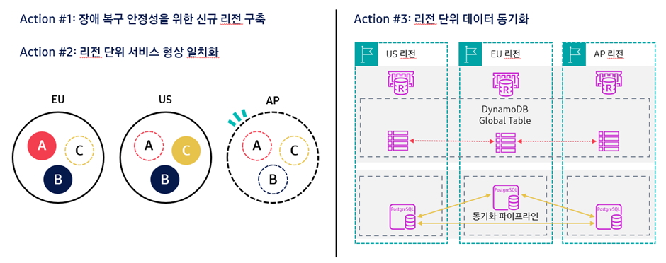
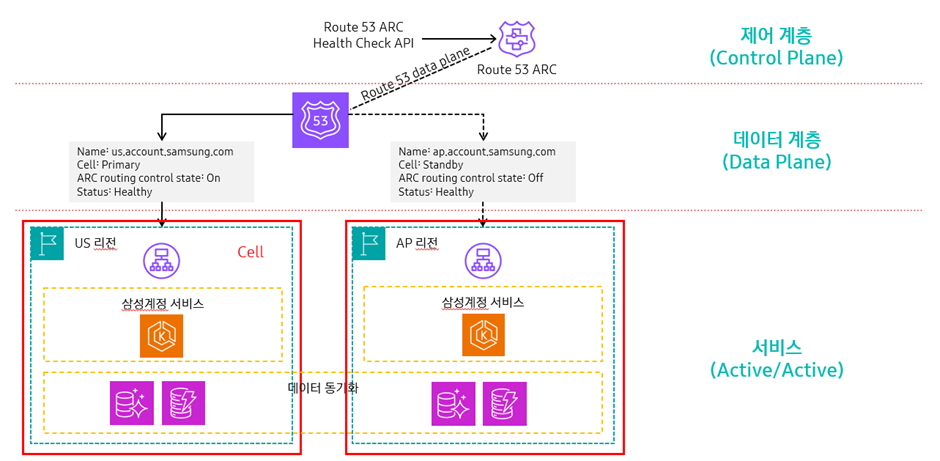

## 1. 삼성 계정이란?

- 전 세계 256개국에서 60여개의 서비스와 앱을 하나로 이어주는 서비스
- 18억명 이상의 사용자를 둔 글로벌 계정 서비스

<aside>
💡

비즈니스 크리티컬 시스템이므로 높은 수준의 RTO를 가지고 있다

</aside>

- 리전 단위 장애도 극복 가능한 아키텍처 필요해 글로벌 리전 장애조치 아키텍처를 새롭게 구축함

## 2. 글로벌 리전 페일오버 아키텍처

- 리전 단위의 장애 DR을 위해 삼성계정은 여러 차례 대대적으로 아키텍처를 개선하고 기존 문제점을 해결

### 문제점 1

- 기존 2개의 리전은 대용량 트래픽을 처리해 클라우드 인프라의 한계에 달하는 리소스 사용중이었음
- 한 리전에 장애가 났을 때 다른리전으로 트래픽이 몰려도 처리하는데 한계

### 해결책 1

- 기존 EU와 US 리전에 이어 신규 AP 리전 구축
    - 트래픽 분산처리를 위한 AP 리전 구축 2024년에 완료

### 문제점 2

- 70여개의 마이크로서비스가 서로 다른 리전에 분산 배포돼 각 리전의 서비스 형상이 맞지 않았다
    - 예시) A기능은 US리전 밖에 사용할 수 없어 재해 복구에 어려움 존재

### 해결책 2

- AP리전 구축 시 각 리전에 분산돼있는 마이크로서비스들을 모든 리전에 구축하는 형상 일치화 작업 진행
- 단일 리전에서 모든 서비스와 기능을 제공할 수 있는 100% 커러비지 가진 아키텍처로 새롭게 구성

### 문제점 3

- 데이터 동기화

### 해결책 3

- 글로벌 3개 리전 필수 데이터 동기화 아키텍처 구축
- PostgerSQL 의 경우 자체 개발 동기화 파이프라인과 MSK 기반 동기화 아키텍처 구축
- DynamoDB의 경우 동기화에 Global Table 사용

<aside>
💡

Active-Active  아키텍처 고도화

</aside>

## 트래픽 전환 제어

### 검토 방안

1. 글로벌 로드 벨런서 기반의 트래픽 전환
    1. 개별 리전에 종속되지 않는 글로벌 로드 벨런서 구축
    2. 리전 장애 발생 시 로드 밸런서에서 정상 리전으로 트래픽 전환
    3. 장점 : 즉각적인 트래픽 전환으로 RTO 짧다
    4. 단점 : 대용량 트래픽을 처리하기에는 큰 비용이 든다
        1. 10년 이상의 삼성 계정 개발 기간동안 시스템이 복잡해지며 수많은 Endpoint를 가진 구조가 되어 글로벌 로드밸런서 적용해야 할 Endpoint가 너무 많아짐
2. **DNS 기반 장애 트래픽 전환**
    1. 비용 부담을 저하 & 복구작업 단순화를 위해 DNS 기반의 트래픽 전환 방식 선택
    2. AWS Route 53을 활용해 리전 단위 장애 발생 시 서비스 도메인의 Endpoint 를 정상 리전의 Endpoint로 전환
    
    <aside>
    💡
    
    큰 문제점 발생 : Route53 은 DNS Record 의 추가와 변경을 처리하는 Control plane 이 US 리전에만 구축되어 있어 US 리전이나 Control plane에 장애가 발생할 경우 원하는 대로 DNS Record 를 추가하거나 변경할 수 없으며 Data plane 의 사전 정의된 기능만 동작 가능함
    
    </aside>
    
    - 한마디로 US 리전 의존도가 너무 커진다
    - Route53의 Control plane 이 동작하지 않으면 장애 시나리오에서 트래픽 전환이 필요해도 DNS Record 를 변경하지 못해 장애 트래픽 전환 제어가 불가능
    
    
    

### 리전 단위 장애 복구 방식

- Control plane 문제 해결 솔루션 - Route 53 Application Recovery Controller(ARC)
- Route53 ARC 는 Control plane 에 장애가 발생하더라도 Data plane에 미리 준비한 Primary 와 Standby 라우팅 제어 세트가 Health Check 를 통해 장애 감지 시 트래픽 제어 기능 제공
- 장애 복구는 셀 단위로 이뤄지는데 셀이란 서비스의 독립적인 장애조치 단위를 포함하는 Silo 를 의미
- 삼성 계정은 리전 단위의 장애를 복구할 수 있도록 셀을 리전으로 구성했고 각 리전은 독립적인 서비스가 가능한 Active-Active 형태로 구축함
- 결과적으로 삼성 계정은 Route53 ARC 의 고가용성 기능을 활용해 리전 단위의 장애조치 아키텍처를 확보할 수 있었음

## 3. 운영환경 모의 장애 훈련

1. 검증환경에서 글로벌 장애조치 아키텍처의 기능 점검하는 기능 검증
    1. 전체 2% 수준의 트래픽 전환으로 기능 점검
    2. 삼성 계정에는 내부 URL 이 많아 트래픽 전환 간에 문제가 발생할 수 있는데, 기능 검증 과정에서 누락된 URL 설정을 미리 확인하고 조치할 수 있었음
2. 장애 복구 트래픽의 부하를 점검하는 부하 검증 진행
    1. 전체 10% 와 50% 두 단계로 나누어 수행
    2. 서비스와 EKS, DB 를 보함한 전 영역의