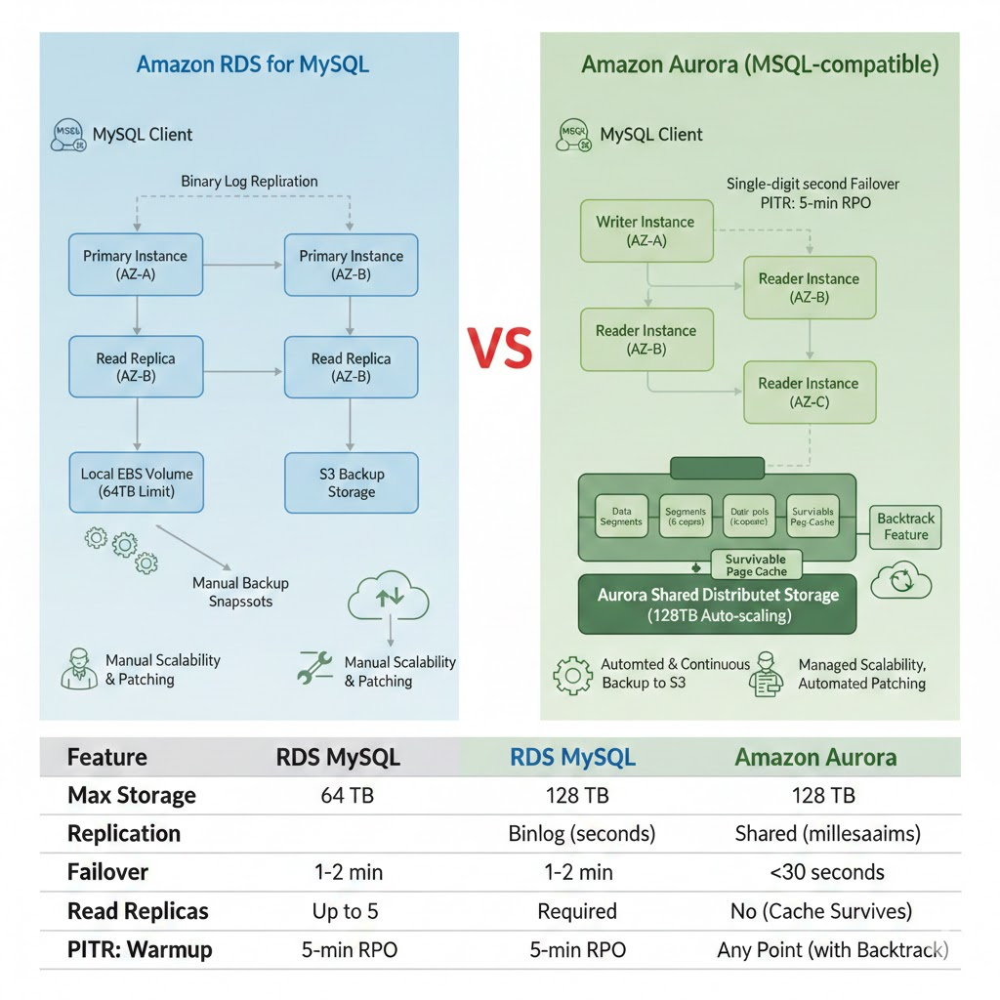
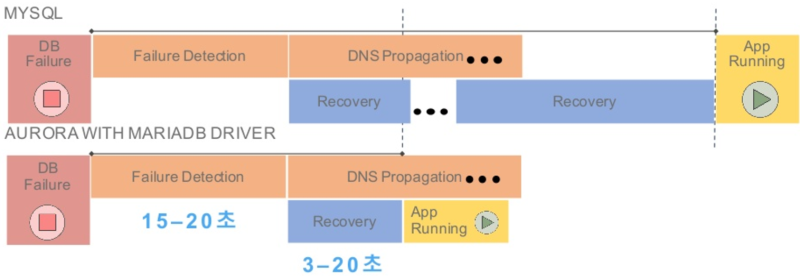

## 구조

### 구조비교 (MySQL vs Aurora)

### Auto-Failover

RDS-MySQL 과 마찬가지로 auto failover가 있음

RDS-MySQL이 보다 Aurora 가 더 빠르게 페일오버되며 읽기 복제가 없다면 15분 이내에 페일오버 가능

### 성능 향상

### 짧은 복제 지연

공유 스토리지를 사용하는 방식이어서 기존 binlog로 복제하는 MySQL에 비해 복제 지연이 없음(밀리세컨 단위)

### 캐시 Warm

캐시와 인스턴스가 분리된 구조여서 인스턴스가 재시작되어도 캐싱된 데이터는 남아있는다

→ 캐시 웜업을 하지 않아도 된다

- 캐시 웜업
    
    데이터를 메모리에 캐싱하기 위해 신규 쿼리가 들어올 때 디스크에 존재하는 데이터를 메모리에 적재하는 과정을 캐시 WarmUp이라고 한다. 웜업 동안은 성능저하 발생
    

### 무한 스토리지 (128TB)

- RDS 는 PIOPS 를 결정해야하고 EBS 볼륨을 얼마나 할당할지 사이즈를 정해서 인스턴스를 생성했어야 했음
    - + 스토리지 사이즈를 늘리려면 성능 감소가 예상됨
- Aurora는 128TB까지 자동으로 할당되며 사용한 만큼 과금됨

### 시점복구 (Restore)

- 백업본을 통해 복구를 할경우에
    - RDS-MySQL은 최대 5분의 손실이 발생했다면(5분 간격으로 복구됨)
        - IDC-MySQL은 어떤시점으로도 복구 가능
    - Aurora는 어떤 시점으로도 복구 가능(현재 시점으로 복구 가능)

### 빠른 Crash Recovery

- MySQL은 Crash 났을 경우 checkpoint 시점으로부터 리두로그를 1개의 쓰레드로 복구 진행
- Aurora는 병렬, 분산, 비동기 방식으로 리두로그를 재생해 빠른 복구 가능

### 스토리지 보안 강화

- 스토리지 레벨에서의 암호화가 가능(TDE개념)
    - 해킹 시 데이터를 통으로 COPY 하는 사례도 있을 수 있는데 암호화를 통해 방지

## 단점

### 비용

- RDS-MySQL 대비 20% 정도 비쌈

<aside>
💡

Serverless v2 사용하면 트래픽 없을 때 비용을 획기적으로 줄일 수 있음

</aside>

### /tmp 디렉토리 사이즈 제한

200G 내외의 사이즈를 가짐

| **항목** | **RDS MySQL** | **Amazon Aurora (MySQL 호환)** |
| --- | --- | --- |
| **최대 스토리지** | 64 TB | **128 TB** |
| **복제 지연** | 초 단위 (Binlog 방식) | **밀리초 단위 (공유 스토리지)** |
| **복제본 개수** | 최대 5대 | **최대 15대** |
| **Failover 시간** | 1~2분 | **30초 미만 (드라이버 사용 시 수 초)** |
| **백업/복구** | EBS 스냅샷 기반 | **S3 병렬 백업 (성능 영향 없음)** |
| **추가 기능** | 없음 | **Backtrack (데이터 되감기)** |