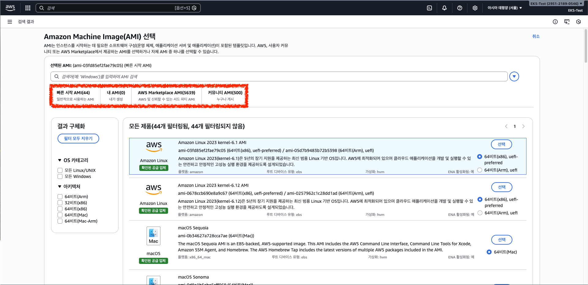

#  AWS EC2 인스턴스 시작 및 구성 가이드

## 1. 이름 및 태그 (Name & Tags)


인스턴스의 식별과 관리를 위한 가장 기초적인 단계입니다.

* **인스턴스 이름:** 이름(Name) 또한 태그(`Key: Name`) 중 하나로 관리됩니다.
* **태그의 역할:** 리소스 사용량을 쿼리하거나 비용 배분 태그를 통해 팀별/프로젝트별 비용 확인이 가능합니다.
* **태그 제한 사항:**
* 리소스당 최대 **50개**까지 생성 가능.
* 키(Key)는 고유해야 하며 최대 128자, 값(Value)은 최대 256자까지 허용.
* **대/소문자 구분:** 태그 키와 값은 엄격히 구분됩니다.
* **접두사 제한:** `aws:` 접두사는 AWS 전용이므로 사용자가 수정하거나 삭제할 수 없습니다.


---

## 2. 애플리케이션 및 OS 이미지 (AMI)


인스턴스의 기반이 되는 운영체제와 소프트웨어 구성을 선택합니다.

* **AMI(Amazon Machine Image):** 인스턴스 시작에 필요한 모든 소프트웨어 구성(OS, 애플리케이션 서버 등)이 포함된 템플릿입니다.
* **선택 옵션:**



* **Quick Start:** AWS에서 제공하는 최신 Linux, Windows 이미지.
* **나의 AMI:** 사용자가 직접 구성하여 백업하거나 템플릿화한 이미지.
* **커뮤니티 및 Marketplace:** 타사 소프트웨어나 다른 사용자가 공유한 이미지를 검색하여 사용 가능.


---

## 3. 인스턴스 유형 및 키 페어 (Instance Type & Key Pair)


### 인스턴스 유형 선택

워크로드의 성격에 맞춰 CPU, 메모리, 네트워크 성능을 결정합니다.

* **스펙 결정:** vCPU 개수와 메모리 크기에 따라 범용, CPU 집약적, I/O 집약적 인스턴스를 선택할 수 있습니다.
* **t3.micro:** 테스트용으로 많이 쓰이는 사양으로, 크레딧 기반의 성능 폭발이 가능합니다.

### 키 페어 (로그인)


인스턴스에 원격으로 안전하게 접속하기 위한 인증 수단입니다.

* **암호화 알고리즘:**
* **RSA:** 오래된 표준으로 호환성이 가장 뛰어납니다. (2048비트 이상 권장)
* **ED25519:** 타원곡선 암호화 기반으로 속도가 빠르고 작은 키 사이즈로도 강력한 보안을 자랑합니다.


* **파일 형식:**
* **.pem:** OpenSSH용(Linux, macOS, PowerShell).
* **.ppk:** **PuTTY** 전용 형식. (PuTTY는 윈도우용 무료 오픈 소스 터미널 에뮬레이터입니다.)


---

## 4. 네트워크 설정 (VPC & 보안 그룹)


네트워크 인프라와 보안 규칙을 정의합니다.

* **VPC 및 서브넷:** 인스턴스가 위치할 가상 네트워크와 가용 영역을 지정합니다.
* **퍼블릭 IP 자동 할당:** 외부 인터넷에서 접속해야 하는 경우 '활성화'가 필요합니다.
* **보안 그룹(Security Group):**
* **인바운드 규칙:** 외부에서 인스턴스로 들어오는 트래픽 제어.
* **0.0.0.0/0 경고:** 모든 IP에서의 접속을 허용하는 설정은 보안상 위험하므로 주의가 필요합니다.


---

## 5. 스토리지 구성 (EBS & EFS)

데이터 저장 공간을 설정합니다. EC2의 기본 인스턴스 스토어는 휘발성이므로, 영구 보존이 필요한 데이터는 반드시 EBS를 사용해야 합니다.

### EBS (Elastic Block Store) 특징

* **독립적 확장:** 인스턴스 사양과 무관하게 저장 공간만 늘릴 수 있습니다.
* **데이터 보호:** **Snapshot** 기능을 통해 특정 시점의 데이터를 버전별로 저장하고 복구할 수 있습니다.
* **이동성:** 하나의 볼륨을 떼어내어 다른 인스턴스에 즉시 연결 가능합니다.

### EBS 성능을 위한 RAID 구성

* **RAID 0 (스트라이핑):** 성능 극대화. 하지만 디스크 하나만 고장 나도 전체 데이터 손실.
* **RAID 1 (미러링):** 안정성 극대화. 동일 데이터를 두 곳에 저장 (비용 2배).
* **RAID 5/6:** 성능과 안정성의 균형을 맞춘 방식 (패리티 비트 사용).
* **RAID 10 (1+0):** 안정성(RAID 1)과 속도(RAID 0)를 동시에 잡은 방식. 하나가 고장 나도 짝꿍 디스크만 복사하면 되므로 복구가 빠릅니다.

### EFS (Elastic File System) vs EBS

| 특징 | EBS (Block) | EFS (File) |
| --- | --- | --- |
| **개념** | 컴퓨터의 내장 HDD/SSD | 네트워크 공유 폴더 (NAS) |
| **연결성** | 1:1 연결 기반 | **N:1 연결** (수천 대 동시 접속) |
| **확장성** | 수동 크기 조절 | 자동 확장/축소 (Serverless) |
| **성능** | 매우 낮은 지연 시간 | EBS보다는 약간 느림 |

---

## 6. 고급 세부 정보 (Active Directory)

기업 환경에서 사용자 및 자원의 중앙 통제를 위해 **Active Directory(AD)**를 연결할 수 있습니다.

* **Active Directory 핵심 기능:**
* **SSO:** 한 번의 로그인으로 권한이 있는 모든 자원에 접근.
* **그룹 정책:** 수천 대의 컴퓨터 설정을 한 번에 일괄 변경.


* **AWS 통합 방식:**
1. **AWS Managed Microsoft AD:** AWS가 직접 관리해 주는 AD 서비스.
2. **AD Connector:** 온프레미스 사무실의 AD 정보를 클라우드로 중계만 수행.
3. **Self-Managed AD:** EC2에 직접 Windows 서버를 깔고 AD를 설치 (제어권은 높으나 관리 부담 큼).

## 7. 인스턴스 권한 및 가용성 설정

### 7.1 IAM 인스턴스 프로파일

인스턴스에 직접 IAM 역할을 부여하여 AWS 서비스(S3 등)에 안전하게 접근할 수 있도록 하는 기능입니다.

* **인스턴스 프로파일 (신분증):** 주체(EC2)에게 권한을 직접 부여합니다. (예: "S3 파일 읽기 허용")
* **S3 버킷 정책 (출입 명단):** 자원(S3) 측에서 접근 가능한 대상을 지정합니다. (예: "A 인스턴스만 접근 허용")
* **사용 이유:** 인스턴스 생성 시마다 버킷 정책을 수정할 필요 없이, 미리 생성된 역할을 부여함으로써 권한 관리를 자동화할 수 있습니다.

### 7.2 자동 복구 및 상태 모니터링

하드웨어 장애 시 인스턴스를 자동으로 복구하여 비즈니스 연속성을 보장합니다.

* **자동 복구:** 상태 검사 실패 시 기존 인스턴스 ID, 프라이빗/탄력적 IP, 메타데이터를 유지한 채 복구됩니다.
> **참고:** M5, C5, R5 등 최신 인스턴스 유형은 이 기능이 기본 활성화되어 있습니다.


* **세부 CloudWatch 모니터링:** 더 상세한 메트릭 수집을 위해 추가 비용을 지불하고 활성화하며, 주로 운영 서버에서 활용합니다.

---

## 8. 중단 및 실행 옵션

### 8.1 종료 옵션 및 방지 설정

인스턴스의 생명 주기를 관리하고 실수를 방지하기 위한 설정입니다.

| 동작 | 설명 | 권장 상황 |
| --- | --- | --- |
| **중지 (Stop)** | 기본값. 전원만 꺼지며 EBS 비용만 발생 | 일반적인 서버 운영 |
| **종료 (Terminate)** | 인스턴스 즉시 삭제 | 일회성 배치 작업, 클라우드 네이티브 설계 |

* **종료/중지 방지:** 실수로 인한 삭제나 전원 차단을 막기 위해 본체에 자물쇠를 채우는 것과 같은 보호 기능을 적용합니다.

### 8.2 최대 절전 중지 (Hibernation)

RAM 데이터를 EBS(루트 볼륨)에 저장하여 부팅 오버헤드를 줄이는 방식입니다.

* **장점:** 실행 중인 애플리케이션 상태를 보존하며 부팅 속도가 빠릅니다.
* **필수 조건:** 암호화된 EBS 루트 볼륨, 150GB 이하의 RAM, 지원되는 OS(Amazon Linux 2 등) 및 인스턴스 유형이 필요합니다.

---

## 9. 성능 및 배치 전략

### 9.1 배치 그룹 (Placement Groups)

워크로드의 성격에 따라 인스턴스의 물리적 배치를 결정합니다.

* **클러스터 (Cluster):** 낮은 지연시간을 위해 단일 AZ 내 가깝게 배치합니다. (고성능 계산용)
* **분산 (Spread):** 최대 안정성을 위해 각 인스턴스를 서로 다른 물리적 랙에 배치합니다. (소수 정예 서버용)
* **파티션 (Partition):** 대규모 장애 격리를 위해 하드웨어를 공유하지 않는 파티션별로 배치합니다. (HDFS, Cassandra 등)

### 9.2 성능 최적화 옵션

* **크레딧 사양 (T 시리즈):** CPU 성능을 끌어올릴 때 크레딧을 소진하며, '무제한' 설정 시 크레딧 부족 시에도 추가 비용으로 성능을 유지할 수 있습니다.
* **EBS 최적 인스턴스:** EC2와 EBS 사이에 전용 네트워크 트래픽을 할당하여 안정적인 데이터 전송 속도를 보장합니다.

---

## 10. 구매 및 테넌시 옵션

### 10.1 구매 옵션 (Purchasing Options)

* **온디맨드 (On-demand):** 종량제 방식. 약정 없이 필요할 때 즉시 사용합니다.
* **스팟 인스턴스 (Spot):** 경매 방식으로 최대 90% 저렴하나, 자원 필요 시 2분 전 예고 후 회수될 수 있습니다.
* **용량 블록 (Capacity Block):** 특정 날짜에 고성능 GPU 자원 등을 예약하여 확보합니다.

### 10.2 테넌시 (Tenancy) 및 보안 실행

* **테넌시:** 공유(기본), 전용(Isolated), 전용 호스트(물리 서버 통째 할당, BYOL 시 필수) 중 선택합니다.
* **Nitro Enclave:** 격리된 보안 공간을 생성하여 관리자조차 접근할 수 없는 수준의 고도의 보안 처리를 수행합니다.

---

## 11. 메타데이터 및 사용자 데이터

### 11.1 인스턴스 메타데이터 (IMDS)

인스턴스 내부에서 자기 자신의 정보를 조회하는 기능입니다. 보안을 위해 **V2(세션 지향 방식)** 사용을 강력히 권장합니다.

* **태그 허용:** 활성화 시 별도 권한 없이 스크립트가 인스턴스 태그 정보를 읽어올 수 있어 자동화 설정에 유리합니다.

### 11.2 사용자 데이터 (User Data)

최초 부팅 시 자동 실행되는 **root 권한 스크립트**입니다.

```bash
#!/bin/bash
# 1. 패키지 업데이트 및 Apache 설치
yum update -y
yum install -y httpd
systemctl start httpd
systemctl enable httpd

# 2. 메타데이터를 활용한 인덱스 페이지 생성
EC2_ID=$(curl -s http://169.254.169.254/latest/meta-data/instance-id)
echo "<h1>Hello from EC2: $EC2_ID</h1>" > /var/www/html/index.html

```

---

**다음 단계:** 이 상세 가이드를 통해 인스턴스 구성을 완료하셨나요? 추가로 **EC2 보안 그룹의 상세 규칙 설정**이나 **Auto Scaling 그룹 구축**에 대해 더 알아보고 싶으신가요?